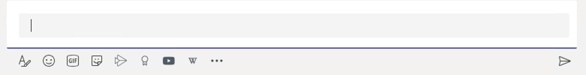

# Build A Code Bot

## Prerequisites

The list of things you'll need if you'd like to tinker with the code for the project is shown below:

1. An Azure subscription ([get started for free here](https://azure.microsoft.com/en-us/free/)).
1. Microsoft Teams
1. [ngrok](https://ngrok.com/) is used to enable localhost debugging and testing. If you're not familiar with ngrok, you can find documentation on setting up an ngrok tunnel to aid in your Bot development [here](https://github.com/Microsoft/BotFramework-Emulator/wiki/Tunneling-(ngrok)).
1. [Visual Studio 2019](https://visualstudio.microsoft.com/) Community or greater editions.

## Running Locally

If you have no experience whatsoever building Teams apps or have never used the Microsoft Bot Framework to build a bot, the process of getting the code running would probably take about an hour. This section will walk through the entire process, from cloning the repository to getting the Code Conversations bot running locally.

1. Clone this repository.

    ```bash
    git clone https://github.com/bradygaster/CodeConversations.git
    ```

1. In the [Azure portal](https://portal.azure.com), click the + sign to create a new resource. Then, search for "bot" and select **Bot Channels Registration**.

    

1. Click the **Create** button on the confirmation screen. Then emulate the settings shown here and click **Create** on the resource-creation sceen.

    

> Note: Leave the **messaging endpoint** text field empty.

1. Once the bot is created, click on the **Channels* button. Then, click the Microsoft Teams icon to Teams-enable your bot.

    

1. Select your appropriate scenario (Government or Consumer), and then check the box to accept the Teams channel terms and conditions on the subsequent screens. Then, click the **Save** button to enable the channel.

1. Click on the Settings tab.

    

1. If you do not yet have an ngrok account and the client installed:

    1. Leave the settings tab open in your browser, and open a new tab. Browse to https://ngrok.com.
    1. Click the "Get started for free" button on ngrok.com.
    1. Follow steps 1 and 2 from the ngrok documentation (shown below).

        

1. Open your terminal and execute the following command to start the ngrok tunnel. This will allow the bot project to connect to your Azure resource during a debugging session.

    ```bash
    ngrok http -host-header=rewrite -log=stdout 3978
    ```

1. Copy the URL of your ngrok tunnel from the terminal window.

    

1. Back in the settings pane in the Azure portal, paste in the ngrok tunnel URL. Then, suffix the URL with the string `/api/messages`.

    

1. Save the bot.

    

1. Click the **Manage** link.

    

1. Click the **New Client Secret** button to create a new secret you can copy into your configuration.

    

1. Give the secret a name. Choose any of the expiries you feel appropriate. 

    

1. Click the **Copy to clipboard** icon to copy the secret. 

    

1. Open the `appsettings.json` file in Visual Studio. Replace the string `{BOT_MICROSOFT_APP_BOT_MICROSOFT_APP_PASSWORD}` with the string you copied from the portal. 

    

1. Click the **Overview** tab in the Azure portal. 

    

1. Click the **Copy to clipboard** icon to copy the **Application (client) ID** to the clipboard.

    

1. Replace the string `{BOT_MICROSOFT_APP_ID}` with the ID you copied.

    

1. Open `TeamsAppManifest\manifest.json` in Visual Studio. Replace the string `{BOT_MICROSOFT_APP_ID}` with the ID you copied from the portal. 

    

1. Later in `TeamsAppManifest\manifest.json`. Replace the string `{BOT_MICROSOFT_APP_ID}` with the ID you copied from the portal. 

    

1. Go back to the **Settings** page for the bot in the Azure portal. Copy the DNS portion of the **Messaging endpoint** to the clipboard.

    

1. In `appsettings.json`, replace instances of the string `{REPLACE-WITH-BOT-DOMAIN}` with the DNS copied from the portal. 

    

1. Also replace the 4 instances of the string `{REPLACE-WITH-BOT-DOMAIN}` in `TeamsAppManifest/manifest.json` with the DNS you copied from the portal.

    

1. For local debugging you only need your ngrok tunnel URL, so remove the other placeholder.

    

1. In the manifest file, you'll see the string `{REPLACE_WITH_ENV_NAME}`. This is, essentially, the way your bot will appear in Teams. When the team was developing, we would use strings such as `Code Conversations (local)` or `Code Conversations (team member name)` once we had multiple instances of the bot running simultaneously. 

     > Note: If your team decides to collaborate on Code Conversations, we'd advise that each team member have their own ngrok account/URL, and their own Azure bot resource. This helps if you happen to try one another's bots out, so you can tell each bot instance from one another. When you have multiple instances of a bot with the same name in Teams, testing can be more challenging, as you can't visually identify one bot from another. 

     

     

1. Right-click the `TeamsAppManifest` folder in Visual Studio and select the **Open Folder in File Explorer** menu option. 

    

1. Select the two files - **not the entire folder** - and right-click-compress them. 

    

1. F5 to start debugging the project. A web browser will open. Leave the browser open until you're finished with the debugging session.

1. Open Microsoft Teams.

1. Click the ... button in Microsoft Teams to add an app. Then, click the **More apps** link.

    

1. Click the **Upload a custom app** link. 

    

1. Click the **Add** button. 

     > Note: You can add the bot to a channel the way in which you can add any other app to a channel. When this screen appears during the "add to channel" flow (or when you want to add the bot to a specific conversation with a friend), click the down arrow and select the appropriate action rather than just clicking the **Add** button.

     

     

1. The bot will welcome you, and give you the opportunity to select a language for this code conversation. Click the **C#** button. 

    

1. The bot will confirm your selection. 

    

1. Start a Markdown code fence by typing the ` character 3 times in the messaging window. Teams will automatically change the message-input display to signal that it knows this is a Markdown code block.

    

1. Type in the code `Console.WriteLine("This is a code conversation");`. Hit enter 3 times to submit the message to the bot, or just click the **Send message** button in the bottom-right corner of the messaging window.

    

    Whenever code writes to standard output, Code Conversations will capture the output and send it back into the thread as a message.

1. Create another message to the bot, this time sending in a simple loop. Paste in the code below and send the message to the bot.

    ```csharp
    for(int i=0; i<10; i++)
    {
        Console.WriteLine($"Iterating, at index {i}");
    }
    ```

    

1. Code Conversations has a rich display editor you can use, too, when the output is more complex than a simple `Console.WriteLine()` call. Enter in something more complex, like the following code that creates a variable.

     ```csharp
     var heroes = new [] {
         new {
             name = "Batman",
             secretIdentity = "Bruce Wayne"
         },
         new {
             name = "Catwoman",
             secretIdentity = "Selina Kyle"
         },
         new {
             name = "Superman",
             secretIdentity = "Clark Kent"
         },
         new {
             name = "The Hulk",
             secretIdentity = "Bruce Banner"
         },
         new {
             name = "The Invisible Woman",
             secretIdentity = "Sue Storm"
         }
     };
     ```

     During a code conversation, the bot will maintain state, so you'll be able to reference variables you've set earlier in the conversation later. To have Code Conversations visualize the new `heroes` variable, type in the word `heroes` (in a Markdown code fence), and send it to the bot.

     > Note: When you shut down the debugging process, the conversation state will be disposed. 

     

     

1. Click the `Open Viewer` button in the Adaptive Card display. You'll be presented a rich dialog that renders the output.

    

1. Open the `src\Samples\Card-Sample.txt` file, select it all, and copy it to the clipboard. Then, paste it in as a Markdown code-fenced message to the bot. The bot will echo the standard output from the code, which provides an update on the setup process of a standard deck of playing cards.

     Once the execution is complete, type the word `deck` in a Markdown code fence, and send the message to the bot. The bot will inform you that rich content has been created. Click the **Open Viewer** button to open the rich display. 

     

1. Now, the card images will be loaded into the rich display. 

    

We'd love to have you try out Code Conversations, look at our Issue list, submit pull or feature requests, or follow the repo for updates. We might add some challenges and bounties soon for those who'd like to collaborate.

If you'd like to experiment more, use the included `src\Samples\Shuffle-Method.txt` code to shuffle the deck, then re-render it. Or, change the `Formatter` section of the deck-creation code from earlier to change the size of the cards when they're rendering in the rich display.

