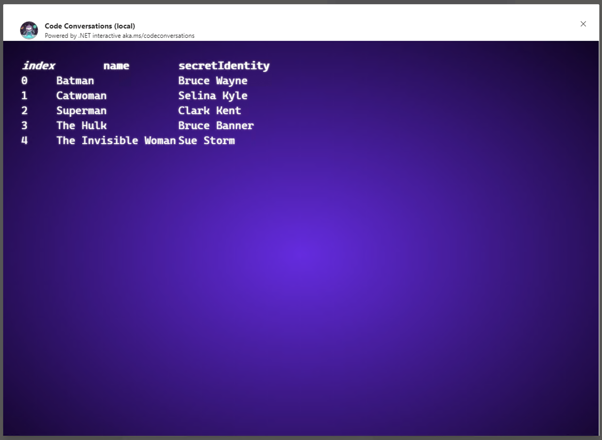

# Code Conversations

During the Microsoft Build 2020 keynote, Scott and Kayla show a demo early on in which they collaborate on some C# source code using a [Microsoft Teams](https://www.microsoft.com/en-us/microsoft-365/microsoft-teams/group-chat-software) Bot. This repository contains the code for that bot, which we call **Code Conversations**. This readme will attempt to explain just about everything you'd need to know about Code Conversations without actually looking at the code. It will also explain a little about the reasons we chose various pieces of the topology.

## How it works

Code Conversations was designed with one goal in mind - to see if we could bring the power of [.NET Interactive](https://github.com/dotnet/interactive) into [Microsoft Teams](https://www.microsoft.com/en-us/microsoft-365/microsoft-teams/group-chat-software), to create a way for people to have collaborative conversations about small bits of code they could edit and run directly within the Teams message thread.

### The Bot

The client is Microsoft Teams, with the Code Conversations bot installed. The bot can be chatted with directly in a 1:1 conversation.

#### Client-side 


The bot can also be added to a Channel in which multiple team members can interact together to have a "Code Conversation."

#### Server-side
The bot was built using the [Microsoft Bot Framework (MBF)](https://dev.botframework.com/). MBF bot code runs inside of [Azure App Service Web Apps](https://azure.microsoft.com/en-us/services/app-service/web/). 

The Web App hosting the code for the bot hosts not only the bot's web app, but the .NET Interactive executable in a background process. 

Teams users have code conversations, the code of their conversations is executed using .NET Interactive, in Azure - not on the Teams users' local computers. This means the code you enter lacks access to any local resources. As the bot executes code, any standard output, like calls to `Console.WriteLine()`, are sent back to the user who sent in the message.

#### Rendering Complex Code 
For more complex code sent to the bot, it presents a richer UI and uses .NET Interactive's formatter.  For example, pasting JSON code like this: 

```csharp
var heroes = new [] {
    new {
        name = "Batman",
        secretIdentity = "Bruce Wayne"
    },
    new {
        name = "Catwoman",
        secretIdentity = "Selina Kyle"
    },
    new {
        name = "Superman",
        secretIdentity = "Clark Kent"
    },
    new {
        name = "The Hulk",
        secretIdentity = "Bruce Banner"
    },
    new {
        name = "The Invisible Woman",
        secretIdentity = "Sue Storm"
    }
};
```

Results in the bot rendering a rich UI that displays the data logically:



You can even use .NET Interactive formatting syntax and helpers to customize the HTML rendering of your code.
You can see more example and experiment with the formatting api with this [ online notebook](https://mybinder.org/v2/gh/dotnet/interactive/master?urlpath=lab%2Ftree%2Fcsharp%2FDocs%2FObject%20formatters.ipynb).


```csharp
Formatter<Deck>.Register((deck, writer) =>
{
    PocketView v = div(deck.Cards.Select(c =>
    {
        var face = Enum.GetName(typeof(Face), c.Face);
        var suit = Enum.GetName(typeof(Suit), c.Suit);
        return img[src:$"https://cardsharpstorage.blob.core.windows.net/cards/{suit}{face}.png", width:64]();
    }));
    writer.Write(v);
}, "text/html");
```

This enables you to quickly create dynamic experiences with teammates using the collaborative nature of Teams.


### Adaptive Cards

When the bot notices code being discussed that renders a more complex output, an [Adaptive Card](https://adaptivecards.io/) is rendered. Adaptive Cards render in a variety of experiences, from Microsoft Teams to HTML pages, Outlook, Windows, iOS, and Android mobile experiences. You can learn more about Adaptive Cards in the [official documentation](https://docs.microsoft.com/en-us/adaptive-cards/), which contains a wealth of example cards, videos on usage, and more.

If you want to build Adaptive Cards interactively to experiment, try out the web-based [Adaptive Cards designer](https://adaptivecards.io/designer/), a web-based WYSIWYG editor that runs in a web browser.


Now that we have gone over all the components that make up Code Conversations, you can try it out on your machine. Please checkout [Build a Code Bot guide](/BuildCodeBot.md). 

## Credits

Code Conversations was built by a few folks but with the help of many teams, both directly and indirectly. This is a list of the folks who immediately contributed to the project, but we could never name all the people who worked on all the products for all the years that actually made it possible.
* [Brady](https://twitter.com/bradygaster) For being the glue that held this experiment together. The joy and technical gudiance you brought to Code Conversations made all this possible.  
* [Maria](https://twitter.com/LadyNaggaga) for the inspiration and vision that has evolved into [.NET Interactive](https://github.com/dotnet/interactive), which will help folks learn to code in new and exciting ways.
* [Diego](https://twitter.com/colombod) for coding heroics on the bot and on the underlying magic of [.NET Interactive](https://github.com/dotnet/interactive).
* [Jon](https://twitter.com/jonsequitur) for your architectural leadership on the project and continued creativity architecting [.NET Interactive](https://github.com/dotnet/interactive).
* [Andrew](https://github.com/clearab) for answering questions on the Bot Framework and for his wisdom and experience as we built, and for all the docs you wrote that helped us along the way.
* [Jon](https://twitter.com/jongalloway) for the name and timeless series of the same name
* [Kayla](https://twitter.com/cinnamon_msft) for telling Scott all about Code Conversations during the event.
* [Scott](https://twitter.com/shanselman) for the idea, the support, and for being ever-inspirational.

Most of all, thank you to our community. The things you build inspire all of us, every day, to continue our mission to help you do more.
